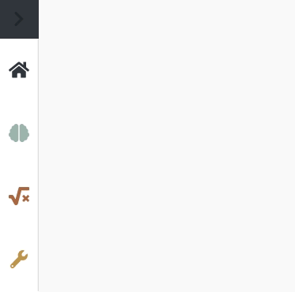

The concept of the interface
============================

Concept of the Layout
---------------------

Next you will see the main page of NEST Desktop with the same concept of the layout for several components:

:Left sidebar: Navigation (it can be closed)
:Center: Main container for the content
:Right sidebar: Controller if provided and it is also closable.

NEST Desktop provides three route pages (Project, Model, Settings) and
a view page can be selected by clicking on stacked, colored buttons right adjacent to navigation panel.

The navigation will be rendered according to the selected view page.
The navigation contains top a navigation header with the name of the module and an icon for the menu,
and subjacent a content section with a list of navigation items.

By clicking on an item in the navigation triggers loading the content in the main container
and if provided in the controller panel.

NEST Desktop follows a clear concept of the page layout which is overlaid by three bars. For the consistence of the page layout each bar has an unambiguous function. Left and right bars are closable and after changing the open status of a side bar the the visualization content in the center bar changes its width format.

Left bar
--------

It is the navigation showing a list of the items which is loaded from individual modules.  A stacked set of buttons (left) renders the content of the navigation and it shows list of the simulations (sketch icon), of the models (square-root icon) and of the settings (wrench icon). When the user click on an item, it loads the content of the center and right bars. The header toolbar stretches over center and right bars and it is color-coded by a loaded page: Project page is summergreen, model is crail and setting page is sycamore. These color palette are generated using deep learning method on the colormind website\footnote{http://colormind.io/template/material-dashboard/}.

Center bar
----------

It provides as router outlets showing the page content of the modules. The project page displays network editor and activity explorer. A model page shows the detailed information of models which can be used in NEST Simulator. Finally, a settings module shows an overview of all settings for application.

Right bar
---------

It is the controller which the user is able to change values. The content of the controller is tabbed by several components, e.g. it displays list of nodes and connections.

.. topic:: Right mouse button

  .. image:: ../_static/img/mouse-right-click.png
    :width: 48px
    :align: left

  When a component provides specific context menu triggering by right mouse button,
  an icon of mouse-right-button-click appears in left bottom of the page.
