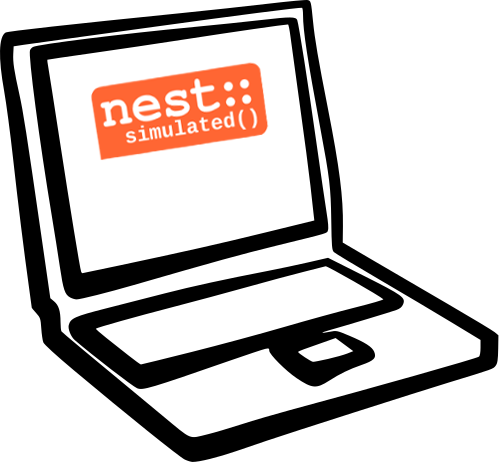

NEST Desktop
============

|
|

Hello there!

It's so great that you want to use NEST Desktop.

Let's get started.

|

||||

How the documentation is organized
----------------------------------

The documentation is organized in three sections addressing to the interest of reader.

.. raw:: html

    

      

        <a href="user/index.html">
          

            
            <h2>The User</h2>
            

              ... learns how to build network, parameterize nodes and links,
              and perform simulations on graphical interface.
            

            I am a user.
          

        </a>
      

      

        <a href="deployer/index.html">
          

            
            <h2>The Deployer</h2>
            

              ... learns how to setup NEST Desktop on a machine via Python Package, Docker or Singularity installation.
            

            I am a deployer.
          

        </a>
      

      

        <a href="developer/index.html">
          

            
            <h2>The Developer</h2>
            

              ... learns the source code architecture of NEST Desktop and how to contribute own codes.
            

            I am a developer.
          

        </a>
      

    

