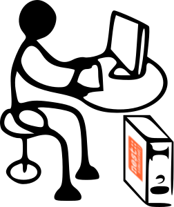

Quick Start
===========

|quickstart|

This guide provides a quick start documentation of NEST Desktop.

.. contents::
   :local:

Getting started
---------------

.. code-block:: bash

   docker run -i -p 5000:5000 -p 8000:8000 -t babsey/nest-desktop

If the image is not exists, it pulls from docker hub.
Then, NEST Desktop is serving at ``http://localhost:8000``.

First steps
-----------

This video provides a quick start in NEST-Desktop.

.. raw:: html

   <embed>
     <video width="696" height="522" controls>
       <source src="../_static/video/quick-start.mp4" type="video/mp4">
       Your browser does not support the video tag.
     </video>
   </embed>

|

Conctruct a network
-------------------

This video demonstrates how to construct a network from scratch.

.. raw:: html

   <embed>
     <video width="696" height="522" controls>
       <source src="../_static/video/construct-network.mp4" type="video/mp4">
       Your browser does not support the video tag.
     </video>
   </embed>

