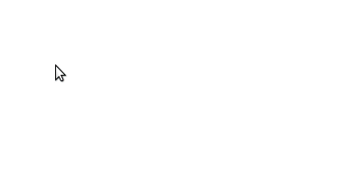
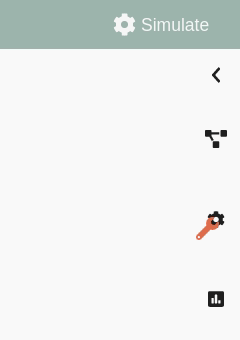
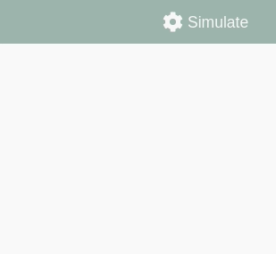
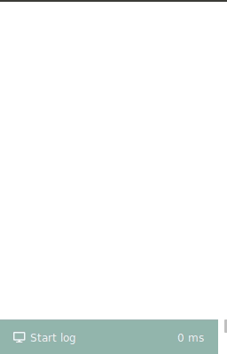

Usage Guide
===========

This guides provides detailed documentation for the Graphical User Interface (GUI) of NEST Desktop.

.. contents::
   :local:
   :depth: 2

Get Started
-----------

Once you start NEST Desktop, you will see the start page a image of a laptop with NEST logo.
At the bottom it shows a short description of NEST Desktop (left) and some useful links and the current version (right)

It checks the compatibility of settings and databases with the application.
When the server responds, the server icon is colored to green.

.. note::
   If you think something is broken, you can reload the page.
   You may want to save a protocol. Go the ``Settings > Simulation`` and enter protocol details under `protocol database`.

Concept of the Layout
---------------------

Next you will see the main page of NEST Desktop with the same concept of the layout for several components:

:Left sidebar: Navigation (it can be closed)
:Center: Main container for the content
:Right sidebar: Controller if provided.

Navigation
^^^^^^^^^^

.. image:: ../_static/img/gif/app-sidenav-left.gif
  :scale: 100%
  :align: left

NEST Desktop provides three root modules (Simulation, Model, Settings) and
a module can be selected by clicking on stacked, colored buttons right adjacent to navigation panel.

The navigation will be rendered according to the selected module.
The navigation contains, top a navigation header with the name of the module and an icon ( |fa-ellipsis-v| ) for the context menu,
and subjacent a content section with a list of items.

|
|
|

Content and controller
^^^^^^^^^^^^^^^^^^^^^^
By clicking on an item in the navigation triggers loading the content in the main container
and if provided in the controller panel.

.. note::
   When a section provides a context menu, triggered by right mouse button,
   an icon of mouse-right-button-click appears in left bottom of the page.

Modules
-------

|fa-square-root-alt| The Model Module
^^^^^^^^^^^^^^^^^^^^^^^^^^^^^^^^^^^^^

The model module includes the description and the management of the neuron, device and synapse models.

In the left panel, it shows lists of available node and synapse models. Nodes can be stimulus devices, neurons or recorder devices.
Once you select a model, the main container displays the documentation as well as a list of parameters with default values.

In the advanced mode, you can manage the models or configure the input panel of individual parameters.
It will store the changes in the model database.
In the input settings you can define the type of input, label, default value and the unit of the parameter.
Additionally, you can adjust slider settings of the model parameters.

The Network Module
^^^^^^^^^^^^^^^^^^

The network module as a part of the simulation module is where you can create and modify networks.

|fa-pen| Network editor
~~~~~~~~~~~~~~~~~~~~~~~

When the view mode is set to 'edit', you will see a stretched area of the network sketch for the drawings.
The right controller shows a network selection of created nodes.
'Selected' parameters will be visible for the parameterization in the simulation mode.

You can switch to sketch settings by clicking on 'bezier-curve' button left to the controller panel.

|fa-shapes| Network sketch
~~~~~~~~~~~~~~~~~~~~~~~~~~

Network sketch is a graphical representation of the network.
You are able to drag, draw and delete node and link elements.

Network list
~~~~~~~~~~~~

It is an fixed list of nodes and links to get an overview of the network.
It appears together with network sketch in simulation details.

Network selection
~~~~~~~~~~~~~~~~~

It is a list of nodes and links, in which you can set the visibility of node parameters.
It appears together with network sketch in the network editor.

Network controller
~~~~~~~~~~~~~~~~~~

It is a list of nodes and links in which you are able to change the parameter values.
It appears together with records visualization in the simulation play.

|fa-eye| Network summary
~~~~~~~~~~~~~~~~~~~~~~~~~~~

The network summary is appropriate view for the printing output in 'PDF' format.

Here, you find a network sketch (top) and a list of nodes and links (bottom).
To improve the affiliation of the nodes and links, each node is labeled by a character and a color.
Each node and link panel starts with a colored header and, if provided, a list of visible parameters.

|fa-brain| The Simulation Module
^^^^^^^^^^^^^^^^^^^^^^^^^^^^^^^^

In the simulation module, a list of simulations and if provided protocols are displayed in the navigation panel.
You can manage (add/delete/download/upload) protocols in the menu by clicking on the 3 vertical dots icon in the navigation header.

.. note::
   Simulations cannot be deleted because they are integrated in the application.

Once you select a simulation/protocol, it will load from the database and ready for the simulation.
In the main container you will see the colored header toolbar and icons.

.. image:: ../_static/img/gif/simulation-toolbar-tabs.gif
  :scale: 100%

These icons switch views of the main container. NEST Desktop offers view mode according to icons:

:pen icon: Modify the network and visibility of the node parameters.
:play icon: Modify the parameter values and visualize the results of the simulation.
:eye icon: View network summary.

|fa-play| Simulation playground
~~~~~~~~~~~~~~~~~~~~~~~~~~~~~~~

When the view mode is set to 'analyze activity', you will see a controller of nodes and links with parameters.
However, the main container remains empty because it does not find records. It is now ready to simulate and
the simulation outcome will be rendered in the main container.

The content shows top left two icons: 'line chart' and 'braille'.
The chart icon switch to chart panel in the main container.
When the recorded neurons are spatial (by clicking on context menu in node header),
it enables the 'braille' for switching to the animation of the records.

You can go to the controller of the network, simulation, chart, animation, and stats of the simulation outcome
by clicking on the stacked buttons in the right side.

|
|
|
|
|
|
|
|
|
|

Configure the simulation
########################

You can click on the `Simulate` button with right mouse button to display the context menu of the simulation.
Here, you are able to change the settings of the simulation.
For instance, check the option that runs the simulation after any change of the network automatically.

|
|
|

Logging
~~~~~~~

Logging component allows you to review the time protocol of the processing checkpoints.
To activate it, go to ``Settings -> Application`` and then check the item ``Log``.
Once it is activated and after a successful simulation, you can see the logging list in the bottom of the navigation section.

|
|
|
|
|
|
|
|
|
|

The Visualization Module
^^^^^^^^^^^^^^^^^^^^^^^^

|fa-chart-line| Chart
~~~~~~~~~~~~~~~~~~~~~

The chart of the recordings is rendered by the library `Plotly.js`.
The chart interface has dragging and zooming handlers.
You can download a snapshot of the current chart by clicking on the camera icon in the top mode panel.

|fa-braille| Animation
~~~~~~~~~~~~~~~~~~~~~~

The animation of the recordings with positions of recorded neurons is rendered by the `three.js`.

|fa-cog| The Setting Module
^^^^^^^^^^^^^^^^^^^^^^^^^^^

The setting module collects settings of the modules.
Once you modified a setting, it will saves as JSON in local storage of the web browser.

.. |fa-bars| image:: ../_static/img/font-awesome/bars.svg
   :width: 16px
   :alt:
   :target: #

.. |fa-braille| image:: ../_static/img/font-awesome/braille.svg
   :width: 16px
   :alt:
   :target: #

.. |fa-brain| image:: ../_static/img/font-awesome/brain.svg
   :width: 20px
   :alt:
   :target: #

.. |fa-chart-line| image:: ../_static/img/font-awesome/chart-line.svg
   :width: 16px
   :alt:
   :target: #

.. |fa-cog| image:: ../_static/img/font-awesome/cog.svg
   :width: 16px
   :alt:
   :target: #

.. |fa-ellipsis-v| image:: ../_static/img/font-awesome/ellipsis-v.svg
   :width: 8px
   :alt:
   :target: #

.. |fa-eye| image:: ../_static/img/font-awesome/eye.svg
   :width: 16px
   :alt:
   :target: #

.. |fa-pen| image:: ../_static/img/font-awesome/pen.svg
   :width: 16px
   :alt:
   :target: #

.. |fa-play| image:: ../_static/img/font-awesome/play.svg
   :width: 16px
   :alt:
   :target: #

.. |fa-shapes| image:: ../_static/img/font-awesome/shapes.svg
   :width: 16px
   :alt:
   :target: #

.. |fa-square-root-alt| image:: ../_static/img/font-awesome/square-root-alt.svg
   :width: 20px
   :alt:
   :target: #
