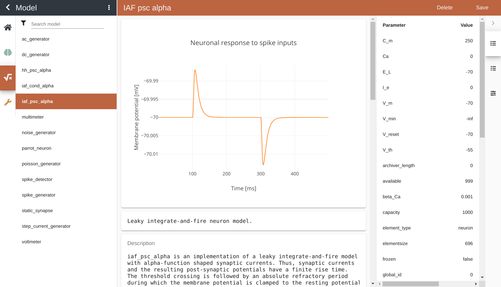
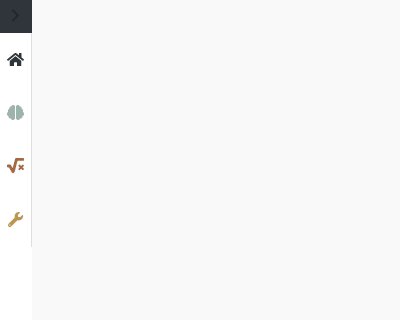
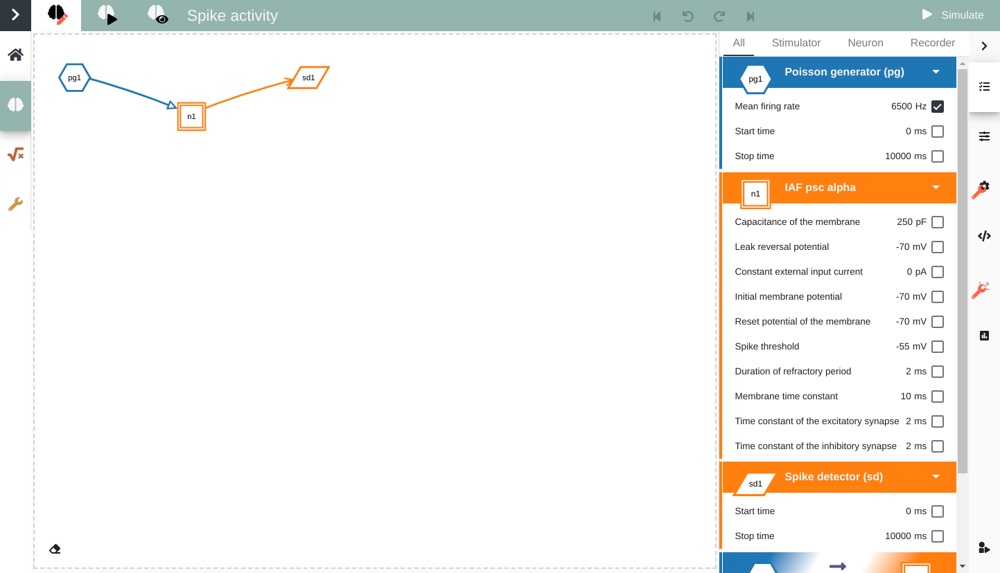
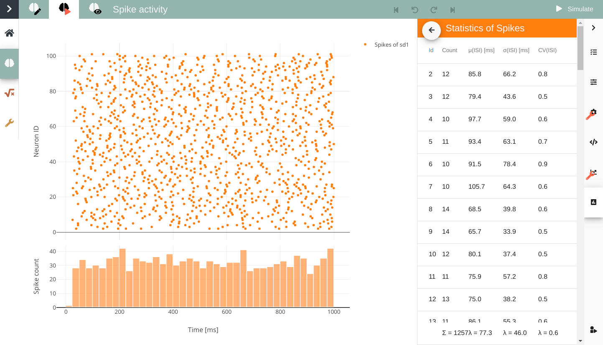

Usage Guide
===========

This guides provides detailed documentation for the Graphical User Interface (GUI) of NEST Desktop.

.. note::
  If you want to see quick start in NEST Desktop we prepared a :doc:`video <index>` showing steps to construct networks and explore activity.

.. topic:: Getting Started

  Once you start NEST Desktop, you see the start page a image of a laptop with NEST logo.
  At the bottom it shows a short description of NEST Desktop (left) and some useful links and the current version (right).

  .. image:: ../_static/img/start-page.png
    :width: 100%

  |

  It checks settings and databases of the application.
  When the server responds, the server icon is colored to green.

  .. note::
    You can reload the page if NEST Desktop is somehow crashed.

|

Explore neuron models and devices
---------------------------------

|

The model page provides you detailed documentation of models.
When a selected model is a neuron, it also shows activity graph of neuronal response to excitatory and inhibitory spike inputs at 100 ms and 300 ms, respectively.

|

Manage projects
---------------

NEST Desktop has project management helping you to organize your networks and network activity.
An important remark is that it stores only neuronal networks in database and activity will be lost after page reload.
If you want to explore activity of the project, you have to start the simulation (See :ref:`Simulation`).

Clicking on a :guilabel:`New project` creates a new project where you can construct network from the scratch (See :ref:`Construction`).
It is useful to give project a proper name that you can recognize your projects (The video shows a bad manner).
An asterisk after project name (instead of time since created or updated) indicates that changes of the project are not stored in database.

Below the search field it shows a list of projects where you can load existed networks.
Clicking right mouse button on a project item in the list shows options to reload, duplicate, download or delete it.
In the project menu, you find other methods to upload, download or delete all projects or to manage them.

The greatest advantage of NEST Simulator is the reproducibility of the activity of the same network, even on other machine.
At result, NEST Desktop shows the same simulation events on different machines.

|

.. _Construction:

Construct neuronal networks
---------------------------

|

If you want to construct network, you have to go to the network editor with the button showing red pen on brain icon.
The network graph is composed of nodes (shapes) and connections (lines).
Here, we explain steps to create and connect nodes.

.. topic:: Create nodes

  .. image:: ../_static/img/gif/create-nodes.gif
    :width: 240px
    :align: left

  |

  In order to create a new node you click the right mouse button in the content area, a `pie` panel  with three letters appears to select a element type.
  A node is divided in three element types: stimulus (:guilabel:`S`), recording (:guilabel:`R`) devices and neuron (:guilabel:`N`).
  Then you select a element type and then it creates a specific node in the center of the `pie` panel.

|
|

.. topic:: Node shapes

  The specific shape defines an element type of a node:

    - **Hexagon:** A stimulus device alias stimulator is an instrument which only produces signals towards target nodes.
    - **Parallelogram:** A recording device alias recorder is also an instrument which observe states of a recordable node.
    - **Square/Triangle/Circle:** A neuron node is the core engine of neuronal network model which received inputs from other nodes and produces specific output using intrinsic equation.

.. topic:: Neuron shapes

  .. image:: ../_static/img/neuron-shapes.png
    :width: 160px
    :align: right

  The shape of neurons is differently represented by the set of synaptic weight of their connections.

    - **Square:** Neurons without connections or mixed (positive and negative) synaptic weights to neurons.
    - **Triangle:** Neurons with excitatory connections to neurons. All synapse weights are positive.
    - **Circle:** Neurons with inhibitory connections to neurons. All synapse weights are negative.

.. topic:: Connect nodes

  .. image:: ../_static/img/gif/connect-nodes.gif
    :width: 240px
    :align: left

  |

  Forming a network of nodes is defined by making connections between and within nodes.
  In order to connect nodes, you select a node, then move the mouse towards other node and finally click a target node.
  It creates a connection between selected source node and clicked target node.

  |
  |

.. topic:: Node labels

  Each node graph is labeled to identify the model of the node.
  By default, it creates direct current generator (:guilabel:`dc`) for stimulus, voltmeter (:guilabel:`vm`) for recording devices.
  Neuron are just labeled by :guilabel:`n`.
  You can see the neuron model in the controller view.

.. topic:: Node colors

  Nodes and connections contains parameter configurations which are displayed in the controller panel in the side navigation.
  The color of nodes helps you to associate the network graph with the controller as well as the visualization of the network activity.
  The color of lines is defined by the source node.

.. topic:: Network controller

  .. image:: ../_static/img/gif/edit-node.gif
    :width: 260px
    :align: right

  You are able to select node or synapse model in the network controller providing two view modes.
  One is the selection mode which is designed to select parameter items for its visibility.
  The other is the editing mode showing only visible parameters allows you to edit it.

  |

.. topic:: Network history

  .. image:: ../_static/img/gif/network-history.gif
    :width: 200px
    :align: left

  With network changes it makes a snapshot of the network afterwards and push to the network history list.
  With this network history you can undo or redo the network changes.

|

.. _Simulation:

Simulate neuronal networks
--------------------------

You can click :guilabel:`Simulate` button to start the simulation of your network. In a controller content you can have an look on script code.

.. topic:: Script code

  .. image:: ../_static/img/script-code.png
    :width: 320px
    :align: right

  NEST Desktop generates textual code from the constructed network.
  The generated code can be applied in any Python interface and you will obtain the same simulation results.
  Here, we show that the code semantics of the NEST Simulator is understandable and easily to learn.

  The graphical representatives of the nodes deliver arguments to the block of ``nest.Create(*)`` function.
  Next, connections supply specification for the block of ``nest.Connect(*)`` function.
  The function ``nest.Simulate(*)`` triggers simulation of your constructed network.
  All recording nodes fills a block to collect activities using the code in PyNEST ``nest.GetStatus(rec, 'events')``. These activities contain neuronal properties, e.g. ids and positions, and activity events.

|

Explore network activity
------------------------

Network activity is composed of neuronal properties (positions and ids of neurons) and recorded events from recording devices.
Events can be subdivided in two groups: spike events or analog signals.
Spike events contains times and ids of the senders emitting events to the recording devices which can be considered as collectors (``spike detector``).
Analog signals contains continuous quantities from the recording devices aka samplers (``voltmeter`` or ``multimeter``) interrogate their targets at given time intervals.
Network activity can be explored in a graph or table.

.. topic:: Activity graph

  .. image:: ../_static/img/activity-graph.png
    :width: 360px
    :align: left

  It displays either a chart graph or animated 3D graph for the spatial network forming layers in topology which neurons has geographical positions.
  The chart graph contains graphical panels organized in vertical stacks.
  Chart panels is introduced specifically to explore network activity with mouse interaction.
  It visualizes scatter graph for spike activity, line graph for analog signals.
  When you add one or more subpanels for spike activity it shows a histogram graph of spike times or of inter-spike intervals.

  |

.. topic:: Activity table

  .. image:: ../_static/img/activity-table.png
    :width: 200px
    :align: right

  You can go to the table by clicking on :guilabel:`Activity statistics` tab button in the right side navigation.
  A table shows simple statistics e.g. :math:`\mu` (mean) and :math:`\sigma` (standard deviation) of activities for a recording device.
  Moreover, Spike events show statistics of :math:`ISI` (inter-spike interval) and :math:`CV_{ISI}` (Coefficient of variation in inter-spike interval).
  Each row represents a recorded neuron (id) from a node connected to the selected recording device.

  |
  |
  |
