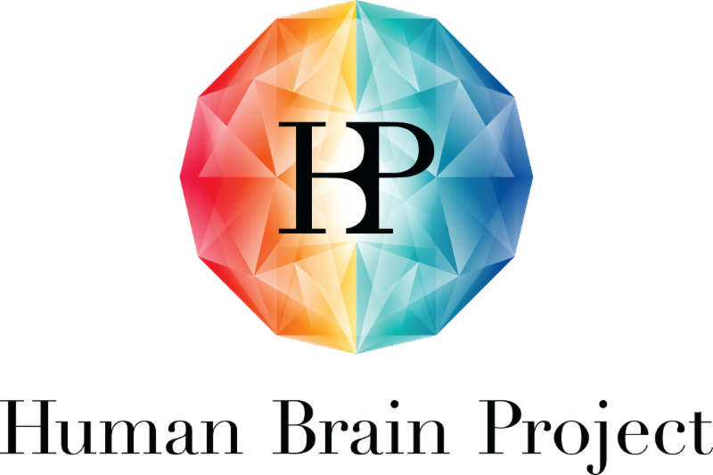

Use NEST Desktop on **HBP**
===========================

|

Human Brain Project (HBP) is a research infrastructure for the researchers in neuroscience, computing and brain-related medicine fields.

NEST Desktop has been selected as a Partnering Project of the Human Brain Project.
The main goal of the project of NEST Desktop is to develop to an advanced GUI for the NEST Simulator and to integrate into HBP infrastructure.
For more information, please follow the link `here <https://www.humanbrainproject.eu/en/about/project-structure/partnering-projects/>`__.

Access to NEST Desktop
----------------------

An *HBP* account is required to access NEST Desktop on *HBP*.

If you have an *HBP* account, follow the link below:

* https://nest-desktop.apps.hbp.eu.

You will see the login interface of *HBP*. Enter you account name and password,
then it directs you to the main page of NEST Desktop.

Request account of *HBP*
------------------------

If you have no *HBP* account, you can ask a member of *HBP* to invite you or request an account here:

* https://services.humanbrainproject.eu/oidc/login

Trouble shootings
-----------------

Why cannot I find NEST Server?
  Sometimes the issue is resolved when you check NEST Server.

  If not, the problem lies in cookies and site data for the user authentication of the *HBP*.
  That cookie expires after a session. This happens when you re-access to ``https://nest-desktop.apps.hbp.eu`` after the browser is closed.

  The simple solution is to reload the page that you can re-login HBP infrastructure.

  A persistent solution is to set the browser configuration that it deletes cookies and site data when the browser is closed (It works in Firefox).
