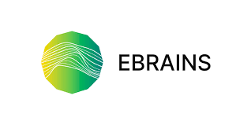

Use NEST Desktop on **EBRAINS**
===============================

EBRAINS is a platform infrastructure for neuroscience.
NEST Desktop is available a a prototype online.
Go to the `description page on EBRAINS <https://ebrains.eu/services/simulation/nest>`__.

.. topic:: Access to NEST Desktop

  .. note:: An *HBP* account is required to access NEST Desktop.

  If you have an *HBP* account, follow the link below:

  * https://nest-desktop.apps.hbp.eu.

  You will see the login interface of *HBP*.
  Enter you account name and password, then it forwards you to NEST Desktop.

.. topic:: Request account of *HBP*

  If you do not have *HBP* account, you can ask a member of *HBP* to invite you or request an account here:

  * https://services.humanbrainproject.eu/oidc/login

.. topic:: Trouble shootings

  Why cannot I find NEST Server?
    Sometimes the issue is resolved when you check NEST Server.

    If not, the problem lies in cookies and site data for the user authentication of the *HBP*.
    That cookie expires after a session.
    This happens when you re-access to ``https://nest-desktop.apps.hbp.eu`` after the browser is closed.

    The simple solution is to reload the page that you can re-login.

    A persistent solution is to set the browser configuration that it deletes cookies and site data when the browser is closed (It works in Firefox).
